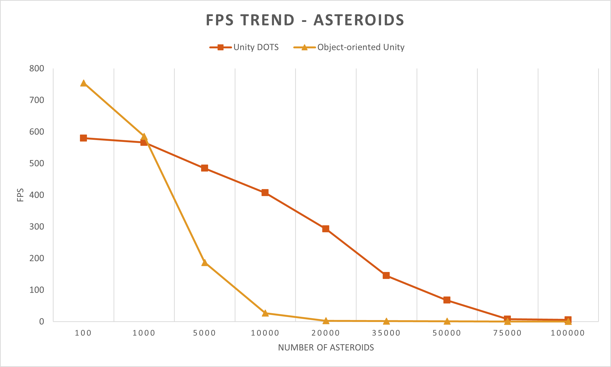
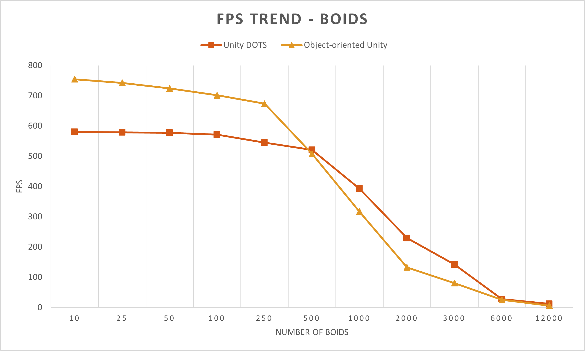
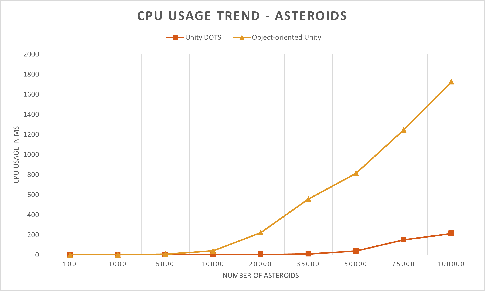
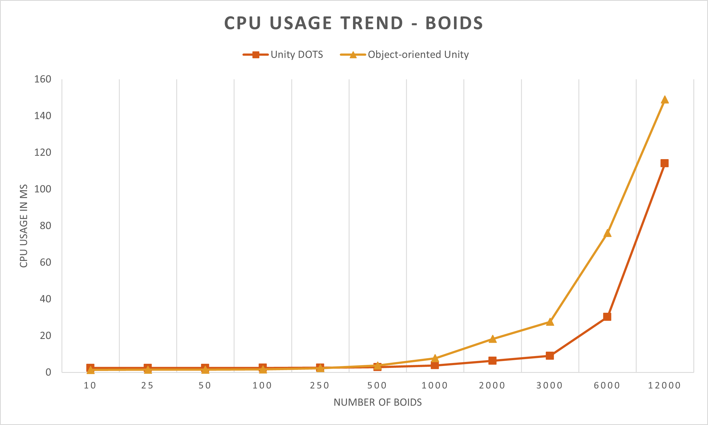

# BA-OOD-Prototype

This project is the first prototype (based on object-oriented Unity) of the performance comparison between object-oriented Unity and Unity DOTS. It was implemented during my bachelor thesis.

## Game concept

The game is about a spaceship that needs to destroy asteroids to increase the score. To instill a sense of urgency, the player is followed by enemies, that behave like boids (similar to flocks of birds). The time limit is 3 minutes. The player can choose the amount of asteroids and enemies that are spawned in the beginning.

Physics / collisions of asteroids are simulated with RigidBody and Collider components to compare the standard Unity physics system to the new Unity Physics package. The boids are used to compare how data-oriented and object-oriented Unity perform with an increasing amount of calculations.

## Short summary of the performance comparison

During the first 20 seconds of gameplay the performance (FPS, CPU Usage Time in ms) of the prototypes was measured. First, the performance influenced by different numbers of asteroid was quantified. Afterwards, the same was done for various numbers of boids. The values are taken from the Unity Profiler + Profile Analyzer and an FPS counter mentioned in the assets section of this README file.

The measurements were conducted with the following setup:
- **Operating system** - Windows 10 (64 Bit)
- **Graphics Card** - NVIDIA GeForce GTX 980
- **System RAM** - 16GB
- **Processor** - Intel(R) Core(TM) i7-4790K CPU @ 4.00 GHz 4.00 GHz

In the beginning, the object-oriented approach outperforms the Unity DOTS prototype, possibly due to the overhead caused by the different packages of Unity DOTS. However, with an increasing amount of elements the Unity DOTS project performs better overall.

## Assets and further sources

The boids aspect of the project is adapted / inspired by a project from [Sebastian Lague](https://github.com/SebLague/Boids). The Object Pool approach is adapted from [Peter Cardwell-Gardner](https://github.com/thefuntastic/unity-object-pool). Lincense notices are in the respective files (MIT License).

The following assets were used:

- [Dynamic Space Background Lite](https://assetstore.unity.com/packages/2d/textures-materials/dynamic-space-background-lite-104606)
- [Lite FPS Counter](https://assetstore.unity.com/packages/tools/integration/lite-fps-counter-probably-the-world-s-fastest-fps-counter-132638)
- [Low poly combat drone](https://assetstore.unity.com/packages/3d/low-poly-combat-drone-82234)
- [Low Poly Space Rocks](https://assetstore.unity.com/packages/3d/environments/sci-fi/low-poly-space-rocks-58385)
